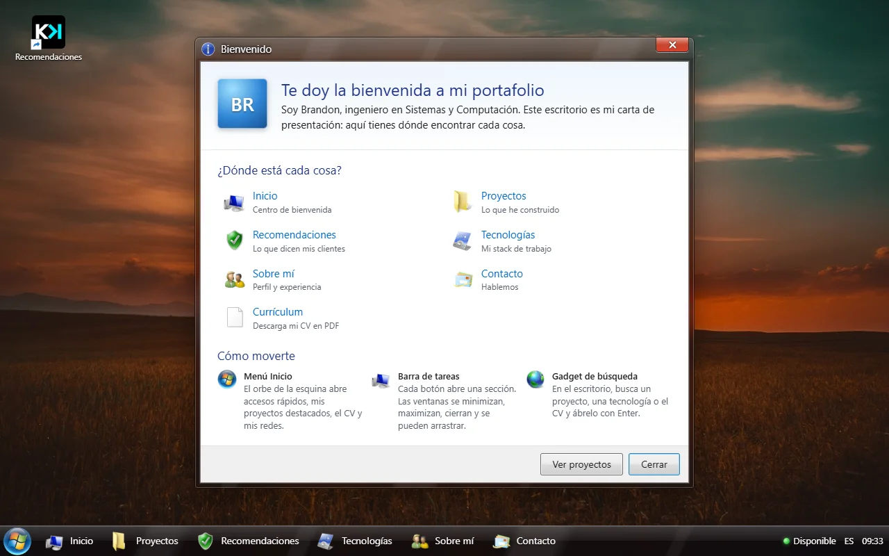
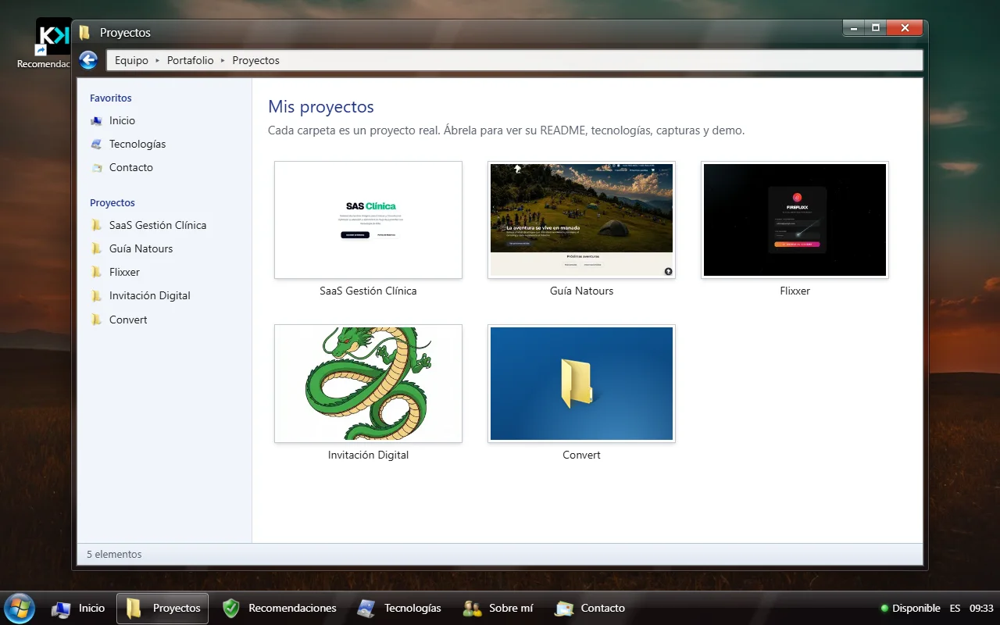
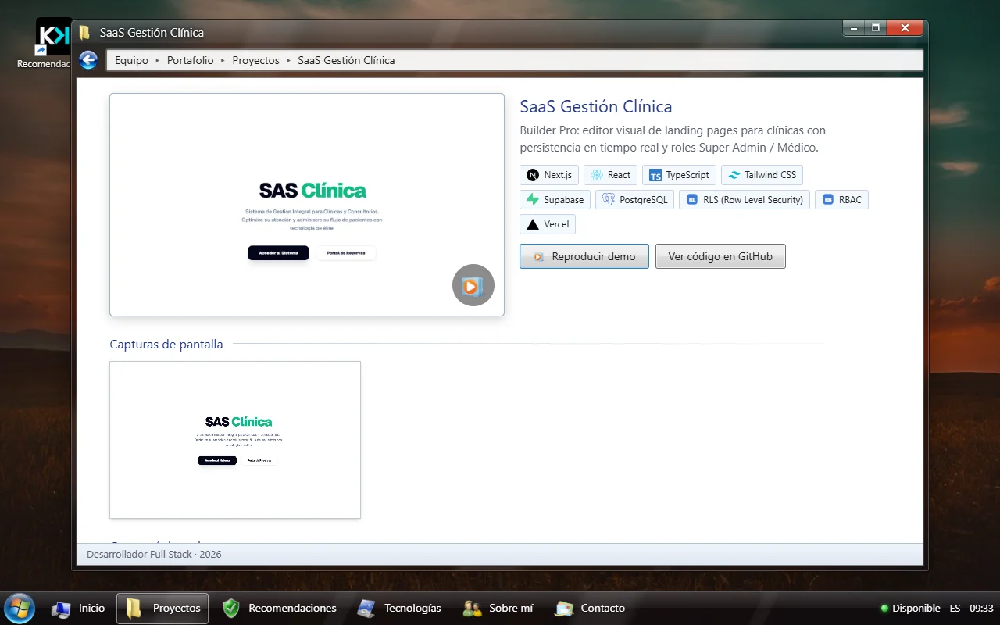
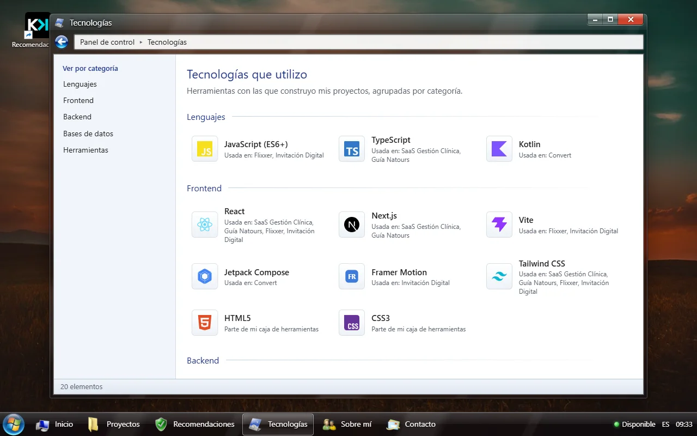
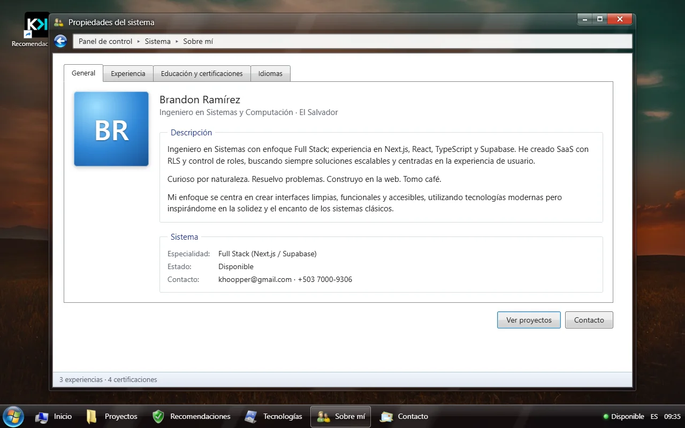
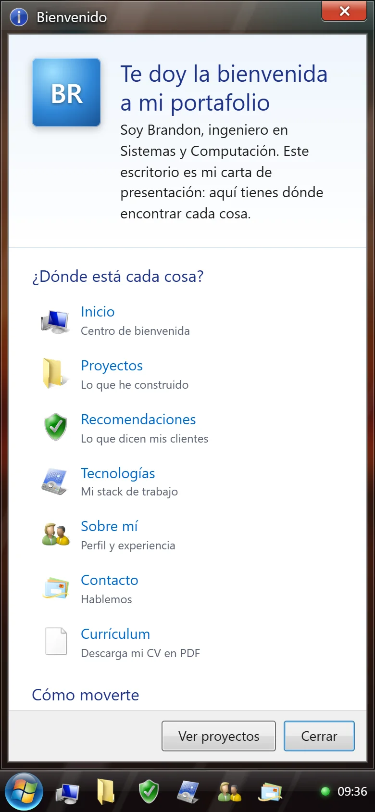

# khoopper.com — Portafolio de Brandon Ramírez

Portafolio personal con la experiencia de un escritorio **Windows 7 Aero**: pantalla de inicio de sesión, escritorio con gadgets, barra de tareas, menú Inicio y ventanas arrastrables para cada sección. Incluye recomendaciones verificadas de clientes y un panel de administración protegido.

**Sitio:** [www.khoopper.com](https://www.khoopper.com)

<p align="center">
  
</p>
<p align="center"><a href=".github/readme/demo.mp4">Ver el recorrido en video (MP4, 28 s)</a></p>

## Capturas

| Inicio de sesión | Bienvenida |
| --- | --- |
|  |  |
| **Proyectos** | **Ficha de proyecto** |
|  |  |
| **Tecnologías** | **Sobre mí** |
|  |  |

<p align="center">
  
</p>

## Stack

- **Next.js 16** (App Router, Server Actions, Proxy) · **React 19** · **TypeScript**
- **Tailwind CSS 3** con tokens propios del sistema visual Aero
- **Supabase**: Postgres con RLS, Auth (correo + MFA y OAuth con Google/LinkedIn) y Storage
- **Vitest** para pruebas unitarias
- Despliegue en **Vercel**

## Secciones

| Ruta | Contenido |
| --- | --- |
| `/` | Pantalla de inicio de sesión de Windows 7 |
| `/escritorio` | Escritorio con la ventana de bienvenida y guía del sitio |
| `/inicio` | Centro de bienvenida: perfil, proyectos destacados y stack |
| `/proyectos` y `/proyectos/[slug]` | Explorador de proyectos y ficha de cada uno (demo, capturas, README) |
| `/recomendaciones` | Recomendaciones verificadas de clientes |
| `/tecnologias` | Stack de trabajo |
| `/sobre-mi` | Perfil, experiencia y estudios |
| `/contacto` | Enlaces de contacto |
| `/p/[slug]` | Vista para compartir un solo proyecto con un cliente |
| `/r/[token]` | Formulario privado para que un cliente deje su recomendación |

## Recomendaciones verificadas

1. Se genera un link de invitación de **un solo uso** (caduca en 30 días) ligado a un proyecto; solo se guarda su hash.
2. El cliente inicia sesión con **Google o LinkedIn** para probar su identidad y escribe su recomendación.
3. La recomendación queda pendiente hasta que se aprueba. El texto del cliente no se puede editar.

## Seguridad

- **Administración**: correo + contraseña + código de un solo uso (MFA TOTP) + verificación anti-bots. Solo una cuenta autorizada puede entrar, y los errores nunca indican qué dato estaba mal.
- **Autorización** en tres capas: Proxy, layout y cada Server Action.
- **Base de datos**: RLS en todas las tablas, vista pública de solo lectura sin datos personales, clave secreta únicamente en el servidor.
- **Sesiones** en cookies `httpOnly`, `Secure` y `SameSite=Lax`, con caducidad por inactividad.
- **Validación** de todas las entradas del servidor, cabeceras de seguridad (CSP, HSTS, COOP, `nosniff`, `frame-ancestors 'none'`) y dependencias auditadas.

## Desarrollo local

```bash
npm install
cp .env.example .env.local   # completa los valores
npm run dev
```

Abre [http://localhost:3000](http://localhost:3000). Las variables están documentadas en [`.env.example`](.env.example); solo la *site key* de Turnstile lleva el prefijo `NEXT_PUBLIC_`, el resto vive únicamente en el servidor. `.env.local` nunca se sube al repositorio; en producción los valores se configuran como variables de entorno de Vercel.

### Base de datos

Ejecuta en orden los archivos de [`supabase/migrations`](supabase/migrations) en el SQL Editor de Supabase. [`supabase/tests/recommendations.sql`](supabase/tests/recommendations.sql) verifica las reglas de acceso y se revierte solo.

## Scripts

| Comando | Uso |
| --- | --- |
| `npm run dev` | Servidor de desarrollo (solo en este equipo) |
| `npm run build` / `npm start` | Build y servidor de producción |
| `npm test` | Pruebas unitarias |
| `npm run lint` | Linter |
